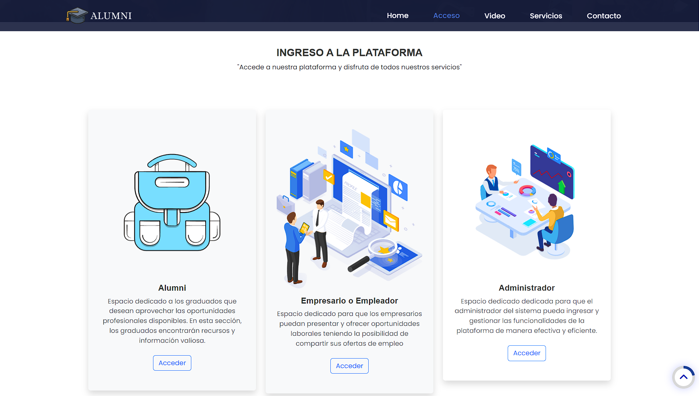
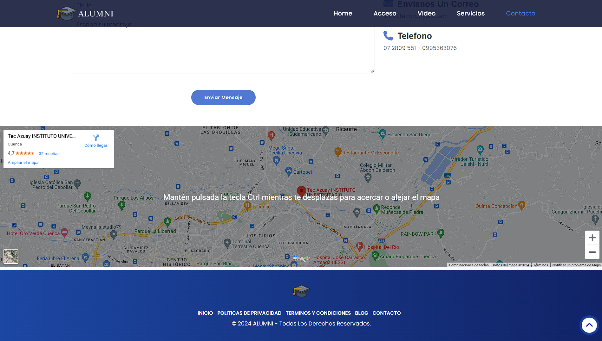
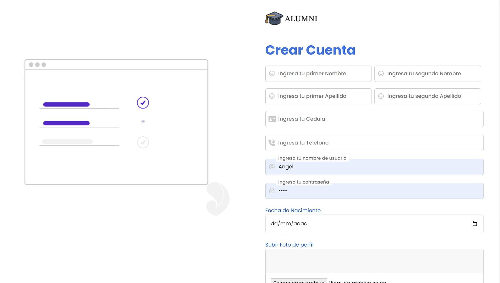
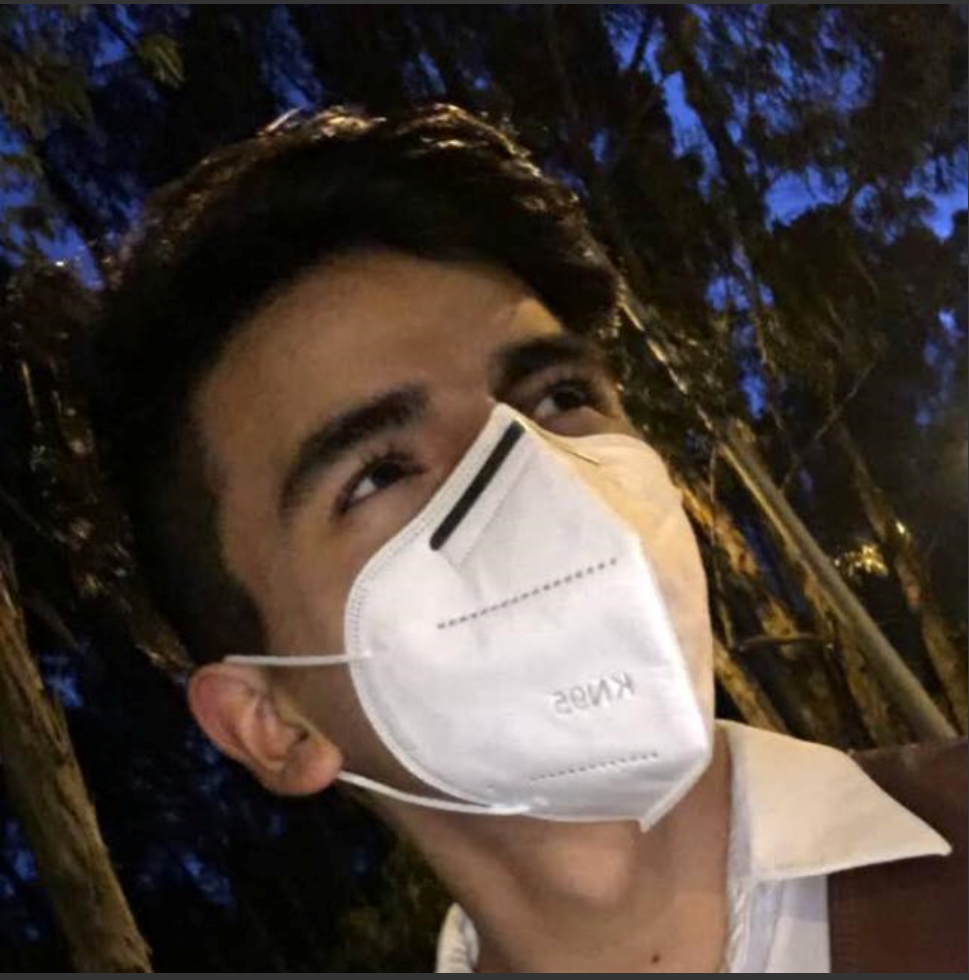
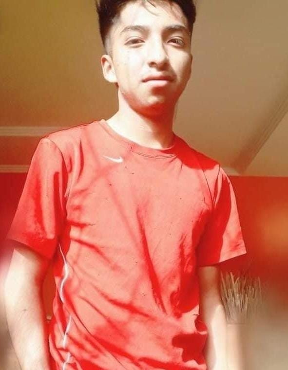

<a name="readme-top"></a>
<!-- PROJECT SHIELDS -->


<br />
<div align="center">
  <a href="https://www.tecazuay.edu.ec/">
    
  </a>

  <h3 align="center">Alumni - M5A</h3>

  <p align="center">
    Proyecto final de la materia de Tendencias de Programación
    <br />
    <a href="https://www.tecazuay.edu.ec/"><strong>Ver Pagina Web»</strong></a>
    <br />
</div>

<!-- ABOUT THE PROJECT -->
## 📖 **Acerca del Proyecto**
Alumni es una aplicación web desarrollada como proyecto final para la materia de Tendencias de Programación. La plataforma fue creada para simplificar y dar vida al proceso de registro de graduados del prestigioso instituto TecAzuay, ubicado en Cuenca, Ecuador. La aplicación incluye tres tipos de perfiles: Alumni, Empresario y Admin.

- **Alumni:** Puede registrar información personal, ubicación, títulos académicos, experiencias laborales, referencias personales y postulaciones.
  
- **Empresario:** Tiene la capacidad de ofrecer oportunidades laborales a los graduados.

- **Admin:** Puede ver análisis de datos generales y tiene control sobre el sistema.

***

## 📖 **Capturas del Proyecto**
<details>
<summary>Capturas de Pantalla y detalle de las mismas</summary>

## Pantalla de Inicio

  **Path:** [http://localhost:4200/#/inicio](http://localhost:4200/#/inicio)
    
    
    
    

  **DESCRIPCIÓN**
  <br>
  En esta ventana se explica el propósito de la aplicación. Se trata de una página web destinada al registro de graduados del instituto TecAzuay en Cuenca, Ecuador. Los perfiles incluyen Alumni, Empresario y Admin, cada uno con funciones específicas.
  
## Pantalla de Login

- **Path:** [http://localhost:4200/#/account/login](http://localhost:4200/#/account/login)


## Pantalla de Registro

- **Path:** [http://localhost:4200/#/account/register](http://localhost:4200/#/account/register)



## Pantalla Dashboard

- **Paths:** 
  - [http://localhost:4200/#/system/alumni](http://localhost:4200/#/system/alumni)
  - [http://localhost:4200/#/system/admin](http://localhost:4200/#/system/admin)
  - [http://localhost:4200/#/system/company](http://localhost:4200/#/system/company)
  
 **Descripción**
 <br>
 Esta pantalla mostrará accesos rápidos a diferentes funciones según el usuario y presentará informes.

### Todas las demas interfaces varian segun el tipo de usuario
</details>

## 😺 **CARACTERISTICAS:**

- Carga de datos rapida.
- Base de datos en nube.
- Diseño amigable y moderno.
- Pantalla de carga, login y todos los cruds funcionales.
- Varias animaciones y diseño responsive.

##  📦 **LIBRERIAS USADAS:**
***

El proyecto ya esta configurado para instalar automaticamente todas las librerias necesarias con:
```bash
npm install
```
En caso contrario, de tener errores, estas son las librerias que se han integrado al proyecto:
```bash
npm i lottie-web ngx-lottie
npm i bootstrap@5.3.2 --save
npm install jquery --save
npm install popper.js --save
npm install @angular/router --save
npm i ngx-bootstrap
npm install --save sweetalert2
ng add angular-datatables (Escoger bootstrap 5)
npm i apexcharts
ng-apexcharts --save
npm i ng-multiselect-dropdown
```

<p align="right">(<a href="#readme-top">back to top</a>)</p>


## Documentación
- Diagramas (Casos de uso, diagrama de clases, MR Normalizado, modelo relacional, entidad relación, diagrama de actividades, diagrama de secuencia, diagrama de robustez): https://lucid.app/lucidchart/84ce5c21-c388-404c-a8ab-ace98ca87dcc/edit?viewport_loc=-4178%2C-2742%2C8451%2C5292%2CQqU35LHIBKCy&invitationId=inv_3553f858-cc9e-43e9-8536-ffe1be8e89caedit#gid=1160663305
- Diagramas (Casos de uso, diagrama de clases, MR Normalizado, modelo relacional, entidad relación, diagrama de actividades, diagrama de secuencia, diagrama de robustez): 
- Normalización: https://docs.google.com/spreadsheets/d/1BgItwj2fKzcZFBpvNE-_8STr3mSaPPhx/edit#gid=361596656
- Historias de usuario: https://docs.google.com/spreadsheets/d/1BgItwj2fKzcZFBpvNE-_8STr3mSaPPhx/edit#gid=1160663305
- Bocetos: https://drive.google.com/drive/folders/1I7NTOAKIi8pGGBYs1IW0vQym75XzgS3R
- Manual Tecnico: https://docs.google.com/document/d/10LfByBkY2k-zxwIZMGnnBX_g98fl37UC/edit
- Manual de Usuario: https://docs.google.com/document/d/1qelVT0N4qPwSSFaiX006uvTIne4j_NuUeB3Sv4Xoi60/edit
- Especificación de Requerimientos de Software (SRS): https://docs.google.com/document/d/1gLYFvM3IbPJQbbtCNMdxIZjGMUSiYCcN/edit?usp=sharing&ouid=116714966189841526689&rtpof=true&sd=true
## 👨‍💼Integrantes Del Proyecto🧑‍🦰
<div align="center">

### FRONTEND

| [<br><sub>Angel Cárdenas</sub>](https://github.com/AngelCarde64) |
| :------------------------------------------------------------------------------------------------------------------: |

</div>

<div align="center">

### DOCUMENTACIÓN Y BACKEND

| [<br><sub>Jose Farez</sub>](https://github.com/Lokyre) | [<br><sub>Vicente Guaman</sub>](https://github.com/SantiagoGuaman) | [<br><sub>Miguel Haro</sub>](https://github.com/Miguel13fdf) | [<br><sub>Evelyn Chichande</sub>](https://github.com/eveelyyn-c) |
| :---------------------------------------------------------------------------------------------------------: | :-----------------------------------------------------------------------------------------------------------------------: | :------------------------------------------------------------------------------------------------------------------: | :-----------------------------------------------------------------------------------------------------------------------: |

| [<br><sub>Luis Duchi</sub>](https://github.com/lduchi) | [<br><sub>Henry Duchi</sub>](https://github.com/Henduchi11) | [<br><sub>Lenin Córdova</sub>](https://github.com/LeninCrdva) |
| :-------------------------------------------------------------------------------------------------------------: | :---------------------------------------------------------------------------------------------------------------: | :------------------------------------------------------------------------------------------------------------------: |

</div>


## FAQs
Una lista de preguntas frecuentes
1. **Cual es el proposito de este proyecto?:**
Este proyecto fue realizado para la materia de _Tendencias Actuales de Programación_ en el 5to Ciclo de la carrera de Desarrollo de Software.